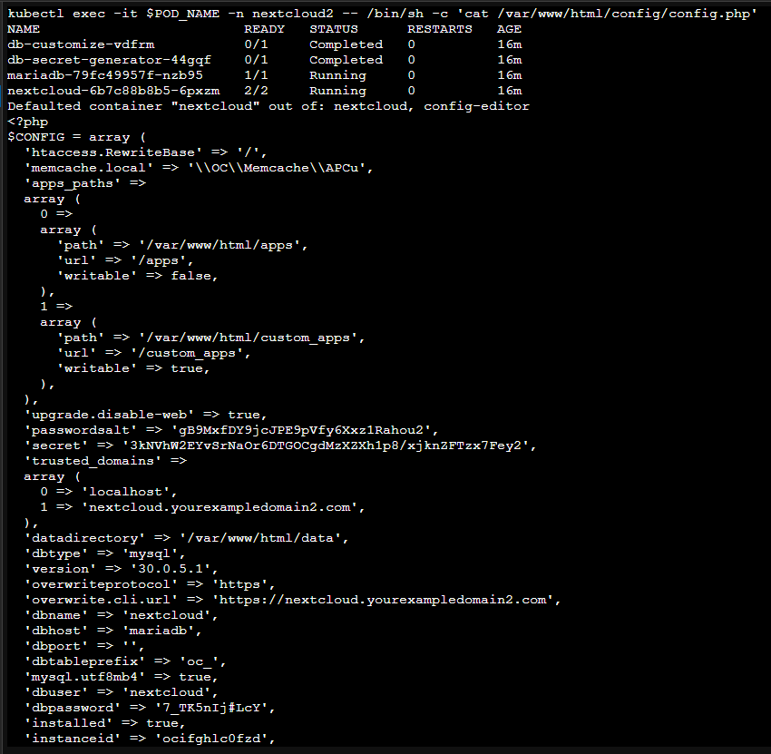

# Install Nextcloud via GitOps with Rancher Fleet

This repository extends the [Proxmox-K3s](https://github.com/benspilker/proxmox-k3s) setup to deploy a **Nextcloud** instance using **Rancher Fleet** in a GitOps-friendly method.

---

## Prerequisites

1. **Kubernetes Cluster with Rancher**: Ensure steps 1–4 of [Proxmox-K3s](https://github.com/benspilker/proxmox-k3s) are completed.
2. **Rancher Fleet CD Pipeline**: You need a working Fleet repo connected to GitHub.
3. **Git Installed**: Git is required on your local machine.

---

## Video Walkthrough

Tip: Right-click and open in a new tab for best experience.

[](https://www.youtube.com/watch?v=KJsWq1SeZp4&list=PLglfnvX1BuSN4ZQVhKbxM6KHA4W2IPl8p&index=8)

---

## Getting Started

### Step 0.A – Setup Local Git Repository

# 1. Clone this repo
    ```bash
git clone https://github.com/benspilker/rancher-fleet.git
cd rancher-fleet
cd ..

# 2. Create and initialize your own Git repo
    ```bash
mkdir new-repo && cd new-repo
echo 'New Readme' > README.md
git init
git add README.md
git commit -m "Initial commit"
git branch -M main

# 3. Change your URL to match Github User
    ```bash
git remote add origin https://github.com/youruser/new-repo.git
git push -u origin main


# 4. Manually copy your test file(s) as needed from rancher-fleet repo into your new folder

# 5. Commit and push the test file(s) as needed
    ```bash
    git add make-namespace.yaml
    git status
    git commit -m "added test yaml file"
    git push origin main
	

### Step 0.B – Setup DNS

Ensure your domain (e.g. `nextcloud.yourexampledomain2.com`) points to the correct Ingress IP (e.g. `192.168.100.203`).

Use the DNS script from [Proxmox-K3s](https://github.com/benspilker/proxmox-k3s/blob/main/5-6_Install-Nextcloud/5A-domainname-dns.sh), but append a `2` to your domainname by modifying the script.

---		
	
### Step 0.C – Copy YAML files 1-7 and push:

   ```bash
   git add .
   git commit -m "Adding all deployment YAMLs"
   git push origin main
   ```

---

## Deployment Overview

The deployment uses seven YAML files, deployed in order (1 to 7). These YAMLs create a new namespace: `nextcloud2`.

| Step | Description                                         |
| ---- | --------------------------------------------------- |
| 1    | Create namespace and apply RBAC for secrets         |
| 2    | Run job to generate a secure Kubernetes secret      |
| 3    | Deploy MariaDB with persistent storage using secret |
| 4    | Customize database (`nextcloud` DB & user)          |
| 5    | Deploy Nextcloud (with sidecar config checker)      |
| 6    | Create and apply self-signed certificate            |
| 7    | Apply Ingress to expose Nextcloud over HTTPS        |

---

## Configuration Timing Note

After deployment, Nextcloud may restart and revert to default config. The sidecar container waits approximately 3 minutes and applies the config again in a loop. Allow up to 5 minutes for the final configuration to take effect.

Accessing Nextcloud before the config is set will result in a "trusted domain" error.

---

## Verify Deployment

Check the generated `config.php`:

```bash
kubectl get pods -n nextcloud2

# Get Nextcloud pod name (exclude MariaDB)
POD_NAME=$(kubectl get pods -n nextcloud2 --no-headers | grep -v maria | grep -v db- | awk '{print $1}' | head -n 1)

# View config
kubectl exec -it $POD_NAME -n nextcloud2 -- /bin/sh -c 'cat /var/www/html/config/config.php'
```

---

## Example Configuration



---

## Redeploy with Custom settings if desired

# Persistent Volume Size Customization

Update the Gi size in these YAML files to customize their volume sizing:

| File                      | Line(s) to Edit |
| ------------------------- | --------------- |
| `3-mariadb-install.yaml` 	| Line 59      	  |
| `5-nextcloud-deploy.yaml` | Line 195	      |


# Domain Name Customization

Update the domain in these YAML files if you use a different domain:

| File                      | Line(s) to Edit |
| ------------------------- | --------------- |
| `5-nextcloud-deploy.yaml` | Line 143        |
| `6-cert.yaml`             | Lines 20, 22    |
| `7-ingress.yaml`          | Lines 8, 20     |

Also make sure your DNS resolution is set correctly (See Step 0B if using a custom domain)
---

## Final Result

You should now have a fully functioning Nextcloud instance with:

* Persistent Storage
* MariaDB Integration
* HTTPS access via self-signed certificate
* GitOps workflow powered by Rancher Fleet

Accessible at: `https://nextcloud.yourexampledomain2.com` (Or your customized domain)

---
